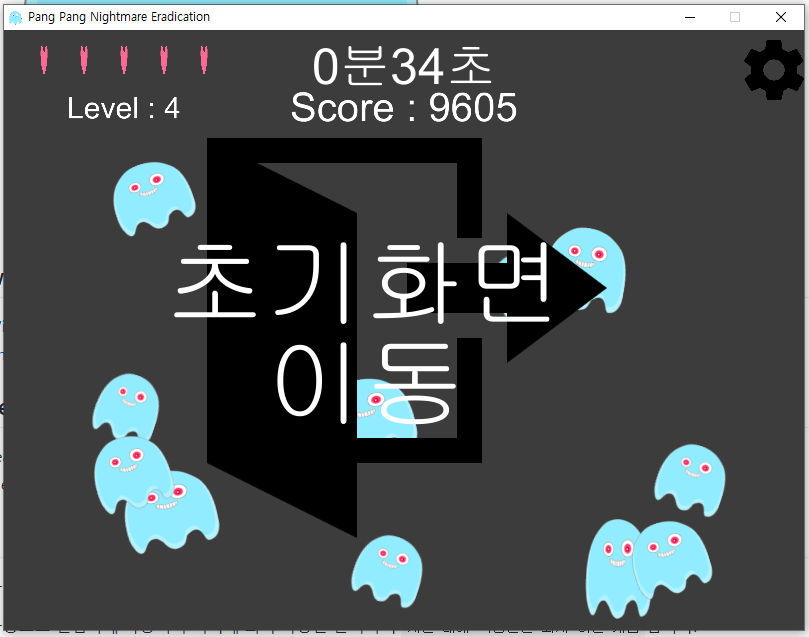

# Unity Pang Pang Nightmare Eradication Game

팡팡 악몽 퇴치 게임

## Download

- [Windows x64 zip file](./build/Pang_Pang_x86_0.0.1.zip?raw=true)
- [Android apk file](./build/Pang&#32;Pang&#32;Nightmare.apk?raw=true)

## Project Team

- Leader : [`박송희`](https://github.com/ParkSongHee) (디자인)
- Member : `이유나` (개발), [`이동건`](https://github.com/Sotaneum) (기획, 개발)

## Info

- 게임 스토리
  - 사방으로 흩어진 이 여러분의 친구들이 괴롭지 않도록 빠르게 선택해서 퇴치해 주세요. 
  - 제한된 시간 내에 최대한 많은 을 퇴치해서 친구와 경쟁하세요.
  - 각 은 일정한 시간이 지나면 친구들 곁으로 다가와 빙글빙글 돌아가는  을 하나씩 뺏어 갑니다.
  - 목숨을 잃지 않고 계속 해 나간다면 누구보다도 더 많은 을 퇴치 할 수 있습니다.
  - 목숨이 0이 되거나 제한된 시간이 0이 되면 게임이 종료됩니다.
- 게임 특징
  - 화려한 임펙트와 아기자기한 배경, 귀여운 캐릭터가 만난 남녀노소 누구나 즐길 수 있는 `킬링타임용 게임`입니다.
  - 중간에 언제든지 게임을 일시정지 할 수 있습니다.
    
  - 일시정지한 게임은 다시 불러올 수 있습니다.
    
  - 게임이 종료되면 아래와 같이 표시 됩니다.
    
  - 플레이를 잘하면 잘 할 수록 더 많은 악몽을 만들어내고 더 높은 점수를 얻을 수 있습니다.
    

## Role

- 게임 구현(개발)
- 게임 기획

## Used Assests

- NGUI 270 (FREE)

## Development Environment

- Unity 5 Personal Edition
- Windows 7 x64 (Desktop)

## What did you learn?

- 게임의 상태를 저장하는 기능에 대해 배웠습니다.
- 모바일에서의 터치(클릭) 이벤트에 대해 배웠습니다.
- 적(악몽)이 사라지는 시간을 각 적마다 다르게 설정하는 방법을 배웠습니다.
- Level에 따라 속도를 다르게 하는 방법도 배웠습니다.
- 다중 터치(클릭)에 대해서도 배웠습니다.

## Finally

- 프로젝트 복구 및 정리가 완료 되면 Score 저장하거나 서버를 통해 등록/조회가 가능하도록 할 생각입니다.
- 간단한 게임이지만 만드는 과정에서 많은 시간이 소요된 것을 보고 기존에 있던 게임들은 얼마나 많은 노력이 필요한 것인지 알 수 있었습니다.

## Modify Content

- 2015.07.14( 0.0.1 )
  - 초기버전 구현

## Copyright

- 게임 내 디자인은 `상업/비상업적으로 사용이 불가`합니다. 해당 부분에 대한 문의는 [여기](mailto:psh6654@naver.com)에 해주세요.
- 그 외의 경우 비상업적 용도로 사용 가능하며 링크를 반드시 포함해주세요.
- 문제가 되는 내용이 있다면 언제든지 [`issue`](https://github.com/Sotaneum/Unity-Pang-Pang-Nightmare-Eradication-Game/issues/new), [`Pull requests`](https://github.com/Sotaneum/Unity-Pang-Pang-Nightmare-Eradication-Game/compare) 부탁드립니다.